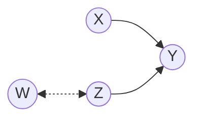
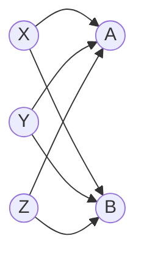
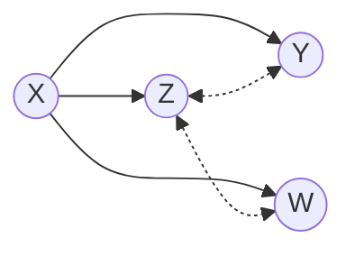
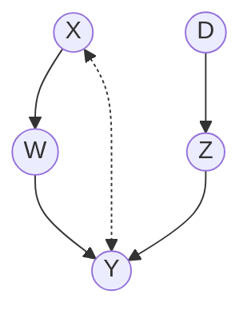

```{r setup, include=FALSE}
knitr::opts_chunk$set(
  echo = TRUE,
  collapse = TRUE,
  comment = "#>"
)
```

# cfid: An R Package for Identification of Counterfactual Queries in Causal Models

<!-- badges: start -->
[](https://www.repostatus.org/#active)
[](https://github.com/santikka/cfid/actions)
[](https://app.codecov.io/gh/santikka/cfid?branch=main)
[]( https://CRAN.R-project.org/package=cfid)
<!-- badges::end -->

```{r, echo = FALSE}
library(cfid)
```

## Overview

This package facilitates the identification of counterfactual queries in structural causal 
models via the ID* and IDC* algorithms by Shpitser, I. and Pearl, J. (2007, 2008) 
https://arxiv.org/abs/1206.5294,
https://jmlr.org/papers/v9/shpitser08a.html. A simple interface is provided for 
defining causal graphs and counterfactual conjunctions. Construction of parallel
worlds graphs and counterfactual graphs is done automatically based on the 
counterfactual query and the causal graph.

For further information, see the tutorial paper on this package published in *The R Journal*: https://doi.org/10.32614/RJ-2023-053

## Installation

You can install the latest development version by using the devtools package:
```{r, eval = FALSE}
# install.packages("devtools")
devtools::install_github("santikka/cfid")
```

## Graphs

Directed acyclic graphs (DAG) can be defined using the function `dag` in a syntax
similar to the [`dagitty`](https://cran.r-project.org/package=dagitty) package.
This function accepts
edges of the form `X -> Y`, `X <- Y`, and `X <-> Y`, where the last variant is 
a shorthand for a latent confounder affecting both `X` and `Y` (a so-called
bidirected edge). Subgraphs can be defined using curly braces `{...}`. Edges
to and from subgraphs connect to all vertices present in the subgraph. Subgraphs
can also be nested. Some examples of valid constructs include:
```{r, eval = FALSE}
dag("X -> Y <- Z <-> W")
dag("{X Y Z} -> {A B}")
dag("X -> {Z <-> {Y W}}")
```
which define the following DAGs:




## Counterfactual variables and conjunctions

A counterfactual variable is defined by its name, value, and the submodel that
it originated from (a set of interventions). For example, $y_x$ is a counterfactual
variable named $Y$ with the value assignment $y$ that originated from a submodel
where the intervention $do(X = x)$ took place.

The function `counterfactual_variable`
and its shorthand alias `cf` can be used to construct counterfactual variables.
This function takes three arguments: `var`, `obs`, and `sub` that correspond
to the variable name, observed value assignment and subscript (the submodel).
For example, $y_x$ is defined as follows:
```{r}
cf(var = "Y", obs = 0, sub = c(X = 0))
```
by default, the value 0 is the "default" or baseline level, and integer values
different from 0 are denoted by primes. For example $y'_x$ is a similar counterfactual
variable to $y_x$, except that it was observed to take the value $y'$ instead of $y$
This can be accomplished by changing the `obs` argument:
```{r}
cf(var = "Y", obs = 1, sub = c(X = 0))
```
Purely observational counterfactual variables (of the original causal model)
can be defined by omitting the `sub` argument.

Conjunctions of multiple counterfactual variables can be constructed using the
function `counterfactual_conjunction` or its shorthand alias `conj`. This
function simply takes an arbitrary number of `"counterfacual_variable"` objects
as its argument. For example, the counterfactual conjunction 
$y \wedge y'_x$ can be defined as follows:
```{r}
v1 <- cf("Y", 0)
v2 <- cf("Y", 1, c("X" = 0))
conj(v1, v2)
```

## Identification

Identifiability of (conditional) counterfactual conjunctions can be determined 
via the function `identifiable`. This function takes the conjunction `gamma` to 
be identified from the set of all interventional distributions $P_*$ of the causal
model represented by the `"dag"` object `g`. An optional conditioning conjunction
`delta` can also be provided. The solution is provided in LaTeX syntax if the
query is identifiable. For instance, we can consider the identifiability
of $P(y_x|x' \wedge z_d \wedge d)$ in the DAG shown below as follows:

```{r}
g1 <- dag("X -> W -> Y <- Z <- D X <-> Y")
v1 <- cf("Y", 0, c(X = 0))
v2 <- cf("X", 1)
v3 <- cf("Z", 0, c(D = 0))
v4 <- cf("D", 0)
c1 <- conj(v1)
c2 <- conj(v2, v3, v4)
identifiable(g = g1, gamma = c1, delta = c2)
```
For more information and examples, please see the package documentation.

## Related packages

- The [`causaleffect`](https://cran.r-project.org/package=causaleffect) 
  package provides the ID and IDC algorithms for
  the identification of causal effects (among other algorithms).
- The [`dosearch`](https://cran.r-project.org/package=dosearch) 
  package provides a heuristic search algorithm that uses
  do-calculus to identify causal effects from an arbitrary combination of
  input distributions.
- The [`dagitty`](https://cran.r-project.org/package=dagitty) 
  package provides various tools for causal modeling, such as finding 
  adjustment sets and instrumental variables.
- The [`R6causal`](https://cran.r-project.org/package=R6causal)
  package implements an R6 class for structural causal models, and provides
  tools to simulate counterfactual scenarios for discrete variables.
